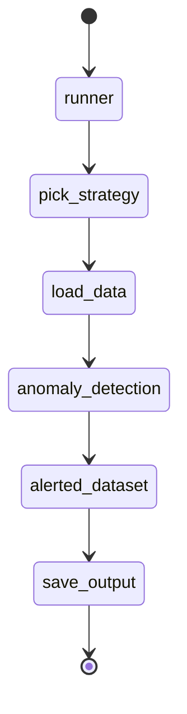

# Anomaly Detection

### This project is a combination of Dask and Strategy pattern to design a losely coupled data pipeline.

## Application Pipeline

```mermaid
stateDiagram-v2
   [*] --> runner
   runner --> pick_strategy
   pick_strategy --> load_data
   load_data --> anomaly_detection
   anomaly_detection --> alerted_dataset
   alerted_dataset --> save_output
   save_output --> [*]
```
